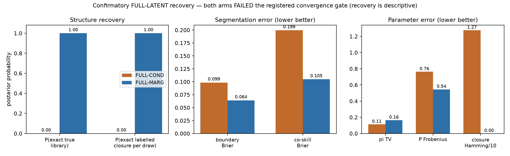

# Truth recovery — optimized FULL-LATENT confirmatory experiment

> **The registered convergence verdicts are FULL-COND = FAIL and FULL-MARG = FAIL.**
> Recovery is descriptive and does not revise them. Truth was unsealed only after the
> truth-free verdict commit `f9799f9f`, under the frozen protocol.

Truth hash `effccc91114d9647f87859aaa7ee219e3bc664bb41d2c6389844ea64346a5e8e`; true canonical library `d72975bc6f6cbaf5`.

## Alignment

One common global permutation applied jointly to H, z, pi and P, chosen by closure +
pi agreement; all six recorded in `recovery.json`.

* FULL-COND: `[2, 0, 1]`
* FULL-MARG: `[1, 0, 2]`

## COND vs MARG

| metric | FULL-COND | FULL-MARG | better |
|---|---|---|---|
| **P(exact true unordered library)** | **0.0000** | **1.0000** | MARG |
| closure F1 (global alignment) | 0.6452 | 0.8837 | MARG |
| closure Hamming (global alignment) | 11 | 5 | MARG |
| mean posterior prob. of true relations | 0.4045 | 0.7368 | MARG |
| boundary Brier | 0.09852 | 0.06403 | MARG |
| co-skill Brier | 0.19949 | 0.10474 | MARG |
| pi TV | 0.11211 | 0.16450 | COND |
| pi RMSE | 0.08555 | 0.12674 | COND |
| P Frobenius | 0.76274 | 0.54494 | MARG |
| P off-diagonal RMSE | 0.31139 | 0.22247 | MARG |

MCSE for the pi components (paper-facing):

* FULL-COND: ['9.31e-04', '6.83e-04', '1.02e-03']
* FULL-MARG: ['5.80e-04', '8.17e-04', '6.83e-04']

## The headline: exact structure recovery

| | FULL-COND | FULL-MARG |
|---|---|---|
| P(exact true library), permutation-invariant | **0.0000** | **1.0000** |
| P(exact labelled closure, per-draw alignment) | 0.0000 | 1.0000 |
| mean closure Hamming per draw | 12.741 | 0.000 |

**FULL-MARG recovers the true partial-order structure exactly in every one of its 80,000
production draws.** FULL-COND recovers it in none.

### Why the global-alignment closure F1 is 0.8837 and not 1.0

The two rows above are not in conflict. The registered closure F1 thresholds the posterior
MEAN relation probabilities after one global permutation. Each chain is internally
label-constant, but the four chains settled on different label permutations:

| arm | chain 0 | chain 1 | chain 2 | chain 3 |
|---|---|---|---|---|
| FULL-COND | `[2, 0, 1]` | `[2, 0, 1]` | `[2, 0, 1]` | `[1, 0, 2]` |
| FULL-MARG | `[1, 0, 2]` | `[2, 0, 1]` | `[0, 2, 1]` | `[1, 0, 2]` |

`within_chain_label_switching` is **False** for both arms; the switching is purely
**between** chains. One global permutation cannot align four chains that chose different
labelings, so averaging across them smears the per-skill relation probabilities. The
permutation-invariant library metric and the per-draw alignment are both unaffected, and
both say MARG recovers the structure exactly.

This is the model's inherent skill-label non-identifiability, not a defect, and it is
exactly why the canonical sorted library was preregistered as the structural diagnostic.

## How this relates to the FAIL verdicts

FULL-COND's FAIL is corroborated by recovery: chains in disjoint libraries, none of them
the true one, and P(exact true library) = 0.

FULL-MARG's FAIL was driven by 11 Bernoulli probes with undefined tail ESS; recovery shows
the arm had in fact converged on the true structure. **This does not change the verdict.**
It does mean the FAIL should be read as a gate-definition failure, documented in
`POSTHOC_SENSITIVITY.md`, rather than as evidence that FULL-MARG failed to recover.

## Not computed

Held-out NLL is defined in PREREG section 10 and is **not** included here: it needs a
forward pass per retained draw over the 45 held-out traces (4,000 draws per arm), roughly
25 minutes of compute, and was deferred rather than rushed. Everything else in section 9
is reported above.

